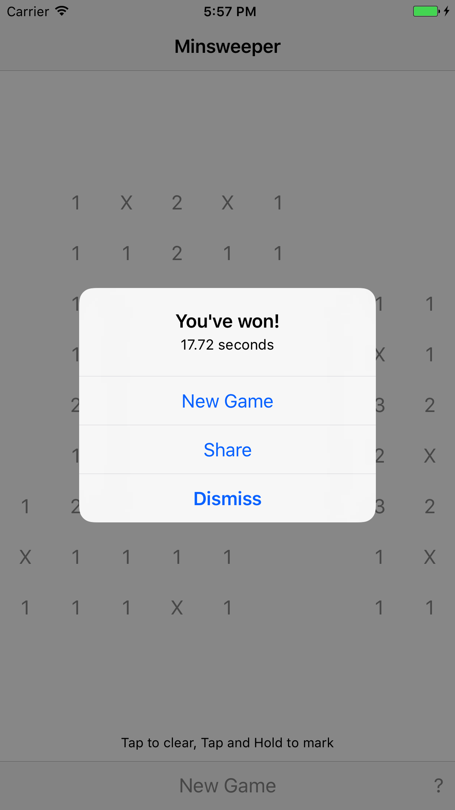

minsweeper
==========

[App Store]: https://appsto.re/us/7dqrjb.i

[Minsweeper: a minimal Minesweeper game.][App Store]

The goal is to clear the minefield. Tap on all the cells that don't contain a mine. Tap and hold to mark mines. The numbers represent how many of the cells around a cell contain a mine. If you tap on a mine, you lose!

[][App Store]

[][App Store]
[][App Store]
[][App Store]
